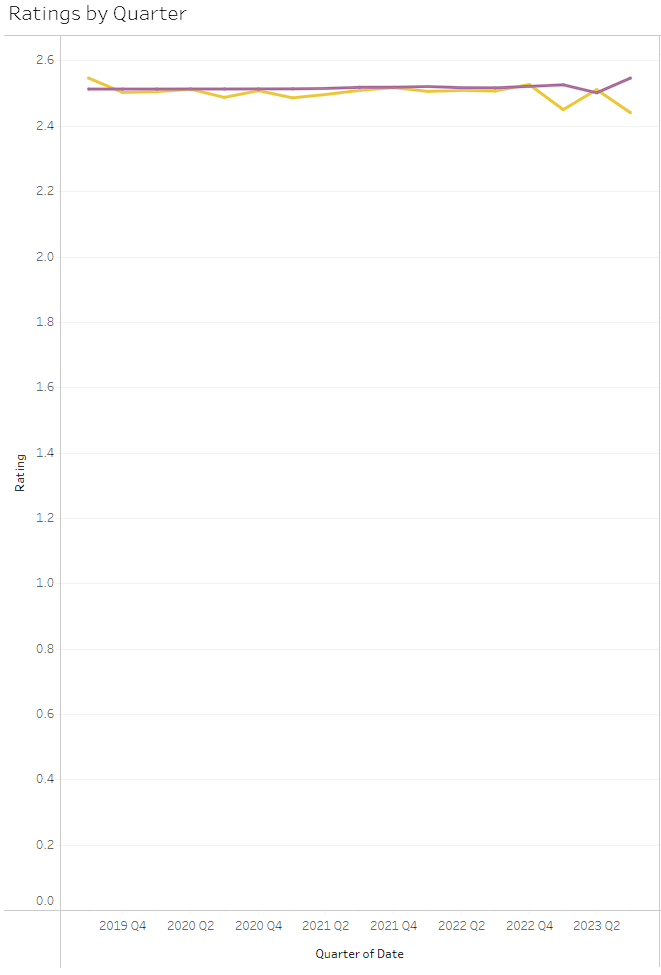

# Travel Data

---

## 1. | Description

## 2. | Goals

## 3. | Plan

## 4. | Process
### 4.1 | Identifying KPI's
After doing some quick research on common KPI's in travel management, I decided to track:

- Use of approved booking channels
- Use of approved forms of payment
- Realized negotiated savings
- Cabin compliance/non-compliance
- Traveler satisfaction
- Carbon visibility
- Booking tool adoption

### 4.2 | Data Collection
Having only 3 days to push the initial version of this project, I settled on a dataset from [Kaggle's 2019 Datathon](https://www.kaggle.com/datasets/leomauro/argodatathon2019?select=flights.csv) rather than spending more time finding an API.

This dataset featured 3 tables: `flights`, `hotels`, and `users`. 

#### 4.2.1 | Data Creation
I wasn't satisfied with just the sample data found online, so I created some simulated data so tracking more of the above KPI's would be possible.

---
##### Adding and populating bookMethod Column
- Added `bookMethod` column to `flights` and `hotels` to indicate if booking was made using companies internal tool
```sql
alter table flights
add column bookMethod varchar(50);
```

- Added a constraint to both tables so only the values `internal` and `external` can be used in `bookMethod`
```sql
alter table flights
add constraint chk_bookMethod check (bookMethod in ('internal', 'external'));
```

- Populated `bookMethod` with random values using `ELT()` and `RAND()` to limit random values to 'internal' and 'external'.
```sql
update flights
set bookMethod = ELT(1 + RAND() * 1, 'internal', 'external');
```
---

##### Adding and populating ratings column
- Added `rating` column to `flights` and `hotels` to indicate ratings for each booking. `tinyint` was used since ratings won't exceed 255.
```sql
alter table flights
add column rating tinyint;
```

- Populated `rating` with random integers using `RAND()`
```sql
update flights
set rating = FLOOR(RAND()*(5-0));
```

- Set ratings of 0 to `null` to indicate bookings that weren't rated by the client
```sql
update flights
set rating = null
where rating = 0;
```

### 4.3 | Data Cleaning

### 4.4 | Data Storing

### 4.4 | EDA

### 4.5 | Initial Dashboard

---
#### Client names and internal booking tool utilization
The first sheet aimed to allow stakeholders to view, filter, and sort client data based on total bookings on record and percentage of bookings created using our internal tool vs. any other third-party tool.


---
#### Total spend and bookings by quarter
The second sheet shows total spend on travel per quarter via a bar chart, and total bookings per quarter via a line above the bars. This graph filters dynamically based on which names are selected in the previous sheet.


---
#### Ratings by quarter
This sheet displays the average ratings per quarter, and is also filtered by the name selection on the first sheet.



---
#### Dynamic line graphs
These graphs allow stakeholders to choose which measures they want visualized, along with a pivot table showing the numbers between bookings made with our internal tool and without.


- The flight/hotel measures selection menu was created using a user-defined parameter field, with a calculated field defining what should happen per the selection in 'Flight Measures'.

---


## 5. | Findings

## 6. | Future Possibilities

## 7. | Things to Improve
- Data on discounted/market rates to better emulate a real-world corporate travel program
- Visualizations clearly showing percent difference between periods
- Data on car rentals (pricing, duration, etc.)
